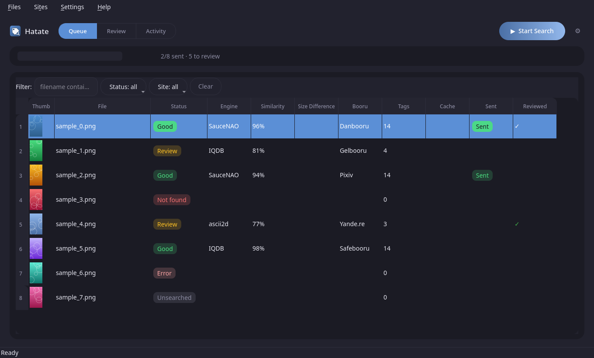
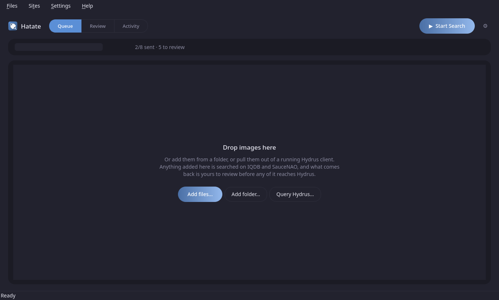
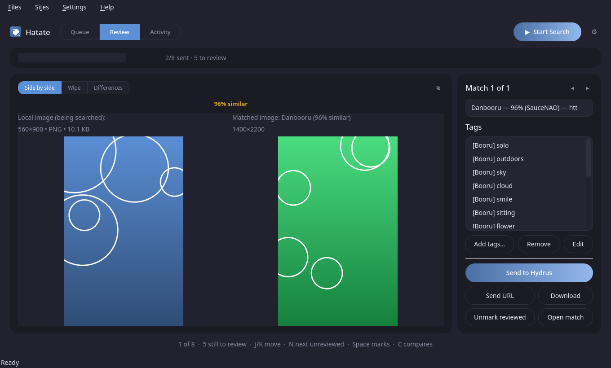
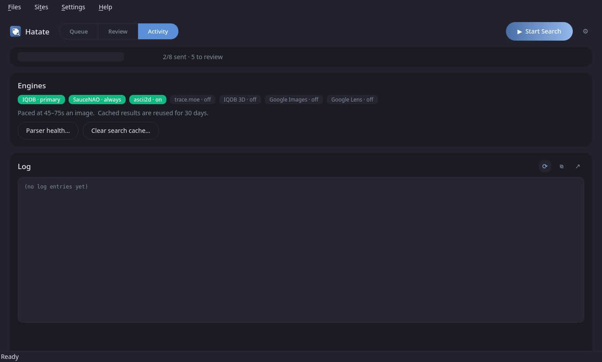
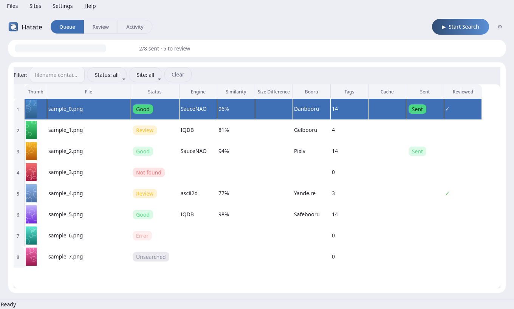

# Hatate-Linux-Redux

A native Linux rewrite of [nostrenz/hatate-iqdb-tagger](https://github.com/nostrenz/hatate-iqdb-tagger)
("Hatate"), which was a Windows-only C#/WPF app. This is a fresh Python +
PyQt6 implementation of the same workflow — it is **not** the original
codebase, since that's C#/WPF and doesn't run on Linux.

This is a redesigned fork of [Hatate-Linux](https://github.com/Dromares/Hatate-Linux).
Everything it does is unchanged — same engines, same parsers, same Hydrus
integration, same keyboard bindings. What changed is the interface.

## The interface

This app does two jobs that want different things from a window. Its own
description of the split:

> The search half of this app is unattended — you start it and walk away
> for a day. The review half is a person deciding what to do with each
> result, a few thousand times.

They used to share one screen: a list, a tag panel and two small previews
stacked in a window whose most prominent control was in the menu bar and
whose *Start Search* button was in the status bar. Now each half has a
mode of its own, and there is a run strip across the top that both can
see, because a batch takes hours and reviewing while it runs is the point.

### Queue — the list



The whole width, which it never had. Match quality reads as a chip rather
than a wall of saturated colour — the pictures are supposed to be the
brightest thing on screen. Status and site filters, and a count that says
how many rows are hidden rather than leaving it a mystery.

An empty list says what to do with itself:



### Review — one image at a time



Your copy against the match, the candidates, the tags and the six
decisions a review pass actually makes. The comparison is no longer a
modal window: **Side by side**, **Wipe** and **Differences** are three
views of the same pair, on one control. Wipe and Differences fetch the
match at full resolution — the preview is a downscaled sample, and
comparing against a sample misrepresents exactly the quality difference
you are trying to judge.

The keyboard is the point here. `J`/`K` move, `N` jumps to the next image
nobody has decided about yet, `Space` records that you looked and kept
your copy, `Return` sends. The strip along the bottom says where you are
and how many are left.

### Activity — what the unattended half is doing



The log as a live pane rather than a dialog, tailing while the run goes —
and following the tail only when you are already at the bottom, so
scrolling back to find where something went wrong is not yanked away on
the next tick. Above it, the engine line-up, stated rather than
remembered: ten engines with three different ways of being enabled is
more than anyone should reconstruct from memory.

### Theme

Dark and light, under **Settings › Theme** — *Follow the desktop*, or
pinned either way. It switches live; there is no restart.



### Finding a setting

Eight tabs and around a hundred controls. The **Find** box at the top of
Settings searches all of them by word, in any order, and counts the tab's
name as part of a setting's name — so "quota pause" finds *Pause
searching when the daily quota runs out*, and "hydrus key" finds *Access
key*, which is the only thing that field is actually called.

*(Screenshots use generated placeholder images, not a real library.)*

## What it does

- Add images from folders/drag-and-drop, or pull them straight out of a
  running Hydrus client via its Client API ("Files > Query Hydrus").
  If Hydrus already knows a file (matched by its SHA256 hash) or you're
  importing it via Query Hydrus, its existing tags are pulled in
  automatically — no prompt. Use the **Add tags…** button next to the
  tag list to add more of your own whenever you want.
- Search each image on **IQDB**, falling back to **SauceNAO** if nothing
  is found (both configurable). When both are enabled they run **in
  parallel** - they are different hosts, so waiting on one then the
  other only lengthened the per-image wait. Optional extra engines,
  also parallel: **ascii2d** (colour/feature search, often finds Pixiv
  and Twitter posts IQDB misses; on by default), **trace.moe** (anime
  screenshots — off by default, monthly quota), **IQDB 3D**
  (`3d.iqdb.org`, for 3D/CG; off by default), and **Google Images**
  (the whole web rather than a booru index — off by default). Google is
  the one that can still find a source when every booru engine comes
  back empty: a personal site, an article, an artist's own portfolio.
  It brings back no tags, only the page.

  Google needs a **Google Cloud Vision API key** (free for the first
  1,000 images a month at the time of writing), set under
  *Settings > Engine*. Be aware that Vision's web-detection index is
  **not the same index as the reverse image search in your browser** —
  measured over a sample of a real library, it found something for 8
  images in 12, and Lens in a browser will sometimes place a picture
  Vision has never seen. For that, see **Google Lens** below. Its public reverse-image page still accepts the
  upload, but it no longer puts any results in the page it sends back —
  they are fetched and drawn by Google's own JavaScript, which this app
  does not run. Without a key the search says so once and stands down
  for the rest of the batch rather than uploading every image to read an
  empty page. It stands down the same way if Google answers with a
  consent wall or an "unusual traffic" check, or if the key is rejected
  or out of quota — all four fail every image identically, so they are
  reported once, not once per row.
- **Google Lens** is a separate engine with its own toggle — the reverse
  image search you get by dropping a picture into images.google.com,
  and a different index from Cloud Vision's. It returns the pages a
  picture actually appears on: DeviantArt, Reddit, Tumblr, Instagram,
  personal sites.

  It drives a **real Chromium**, because Google builds those results
  with JavaScript and QtWebEngine's Chromium fork cannot run its
  front-end (its own script throws, and the request that fetches the
  results goes out with an empty session id). A stock Chromium runs the
  same page correctly. Optional, and not installed by default — it is a
  ~150MB browser that nothing else here needs:

  ```
  venv/bin/pip install playwright
  venv/bin/playwright install chromium
  ```

  Install it for **the Python you actually launch with**. `./run.sh`
  uses the project's `venv/`, but running `python3 main.py` by hand uses
  your system Python, and a package installed in one is invisible to the
  other — the engine will report it as missing. If the engine says it is
  missing, the message names the exact interpreter to install into.
  On distributions that refuse `pip` for the system Python (Arch and
  friends, PEP 668), launching with `./run.sh` is the easiest fix.

  A Chromium window opens while a Lens search runs. That is deliberate:
  headless is challenged on sight, and a visible window is what lets you
  answer Google's "check you aren't a robot" when it appears. The
  profile is kept under `~/.config/hatate-linux/lens_profile`, so
  answering once carries the rest of the run — and the browser does a
  couple of ordinary searches on first use, because a profile with no
  history behind it gets challenged nearly every time.

  On KDE Plasma the Lens window keeps off the taskbar while it works, so
  its searches don't pop up an auto-hide panel. When Google asks for a
  robot check it comes back onto the taskbar and asks for your
  attention - the one time it needs you - and goes quiet again once
  answered. Elsewhere the window behaves as any other.

  Google challenges on how often it is asked, so Lens searches start at
  least 45 seconds apart however they were started — a batch, or one
  re-search after another. If a robot check goes unanswered, Lens rests
  for 30 minutes rather than asking again on the very next search, which
  only brings another check; rows searched meanwhile say so.

  Lens has two result tabs and they behave very differently. **Visual
  matches** embeds its source URLs, so those come through directly.
  **Exact matches** — the better ones, since an exact match is the same
  picture rather than one that merely looks like it — renders tiles with
  *no link at all*: no `href`, no data attribute, and nothing in the
  response but the title. Both tabs are opened — Exact matches used to be
  reached only when Google happened to show its explicit-results notice,
  so a post sitting there was invisible on every other image. Where a
  title carries the post's id, the match is rebuilt from it and sorted
  above the visual ones. Recognised so far: Paheal (`Post 5674224: …`),
  rule34.xxx (`Rule 34 | 4585855 /`) and rule34.us
  (`… / 368224 - Rule34.us`). Google does not reliably put the site's name in the
  title — sometimes it appends it, sometimes it renders it in a separate
  element further down the tile — so the name is looked for in the tile
  around the title, stopping at the next result. Sites without a verified pattern are
  left alone — a guessed URL looks like a real match until you click it.

  Lens picks a **search area** out of the picture and searches only
  that. Usually it takes the whole image, but it can settle on one part
  of it — observed at 78% × 93% and smaller — and then the results are
  about that part rather than the picture you searched for.
  *Settings > Engine > Search the whole picture* (on by default) drags
  the crop back out to the full image the way a person would, and only
  on the images Lens actually cropped.

  The crop is read from the page's own crop handles, which state it
  outright (`top left corner of search area: left 9%, top 4%`). It is
  deliberately not read from the URL: that carries a region too, and it
  reports the whole image even while the handles say otherwise. Turn it off to
  take Lens's own choice, which occasionally picks the character out of
  a busy collage better than the whole frame would.

  Google hides the matches for an explicit image behind a *"these
  results may be explicit"* confirmation. The engine clicks through it,
  so a library full of them doesn't need a click per image. On a picture
  like that the match's title is often the source's own tag list
  (`metroid, nintendo, samus aran, zero suit samus, tekuho`), which
  makes the row worth reading on its own. Paheal posts recovered this
  way classify as **Paheal** in the Sites menu and have a tag parser
  (`core/boorus/paheal.py`), so they bring back their tags, dimensions
  and original file like any other booru match. rule34.us posts do the
  same, as **Rule34.us** (`core/boorus/rule34us.py`).

  **Reddit** posts Lens finds are read through each post's public RSS
  feed (`core/boorus/redditpost.py`) — Reddit's JSON API refuses
  anonymous clients. A post brings its original `i.redd.it` file, a
  preview, its real dimensions (read from the file's first bytes) and
  `subreddit:` / `title:` tags; the poster isn't tagged as the creator,
  since on Reddit that is as often a reposter. A gallery is taken as its
  first image. Reddit allows an anonymous client very few requests —
  one can use up the allowance for the next 20-odd seconds — so the app
  waits for the reset Reddit announces rather than being refused.

  The upload's **format is checked first**. Lens reads JPEG, PNG, WEBP
  and BMP — **not GIF**, despite that being a picture format Google
  serves everywhere else. Measured on one file uploaded both ways in the
  same session: as a GIF it got "can't read file" and 0 matches, as a
  JPEG it got 3 including two booru posts. Anything animated goes the
  same way, since Lens searches for one picture and a still frame is
  what it can use. A Hydrus library also holds AVIF, JPEG XL, TIFF and
  video, and sending one of those gets the same "can't read file" —
  which from the outside looks exactly like "Google found nothing". Anything
  outside the accepted set is re-encoded to JPEG on the way out
  (transparency flattened onto white, not the black the default
  conversion gives), and anything that cannot be re-encoded is refused
  with a reason. That refusal is about the one file: the other engines
  still search it, and the next image still goes to Lens.

  It is the slowest engine here — each image is a real page load, so it
  gets at least 90 seconds regardless of the general search timeout —
  and like the others it returns a source page, not tags. Best used
  through right-click > *Google Lens only* on the handful of images
  nothing else could place, rather than across a whole library.
- **Yandex** (*Settings > Engine > Also search Yandex*, off by default)
  is yandex.com's reverse image search, over plain HTTP — no browser, so
  it costs seconds per image, not Lens's minute and a half. Tried on 72
  images that IQDB, SauceNAO and Lens had found nothing or only a poor
  match for, it placed 7 on a post the app can tag from, mostly
  **rule34.us**, which IQDB doesn't index, plus Danbooru and Xbooru.
  Yandex turns up a great deal more than that (Pinterest, Telegraph,
  reposting blogs), but none of it carries tags, so only post pages on
  sites with a parser are kept. Like the Google engines it reports no
  similarity, and each result is measured against your picture from its
  thumbnail. If Yandex asks for a captcha it rests for half an hour and
  the other engines carry on. Each picture is uploaded to Yandex, which
  is why it is opt-in.
- **Pawchive** (pawchive.pw, an archive of Patreon and Fanbox posts) is
  indexed by neither SauceNAO nor IQDB, so its posts never came up. It
  doesn't need to be: pawchive stores every file under its own SHA-256
  and answers a lookup by hash, and this app already knows each file's
  SHA-256. Turn on *Settings > Engine > Also look files up on Pawchive*
  and every image is checked with one small request — nothing uploaded,
  only the hash sent. A hit is the **same file**, so it is a certain 100%,
  and the post brings its artist and tags. It always runs alongside the
  first engine, even with the extras held back for fallbacks. It finds
  byte-identical copies only: a resized or re-saved copy has a different
  hash. In a 200-file sample of a real library, 8 were on pawchive.
- **The Pawchive index** finds the copies the exact lookup can't: resized,
  re-compressed or re-saved ones. Pawchive has no search by picture, so
  *Files > Pawchive Index* builds one locally for the artists you choose —
  find them by name, paste a pawchive link, or add every artist your
  pawchive matches already turned up. Indexing lists an artist's posts and
  fingerprints each image's small thumbnail, about one a second, and a
  refresh only fetches what is new; stop it at any point and the next run
  carries on. Searching it is part of every search once anything is
  indexed (*Settings > Engine > Search my Pawchive index*), happens on
  this computer, and sends nothing.

  It ranks by a 256-bit fingerprint rather than the usual 64-bit one,
  because the smaller one scores an image's edited variants as identical.
  90% and up means the same picture; variants land below that, so
  auto-import leaves them for you to check. The whole site is out of
  reach on purpose: pawchive holds about 95,000 artists and its listing
  can only be walked artist by artist.
- **Fall back on a weak match, not just on no match.** Normally the
  fallback engine runs only when the first one finds *nothing*, so a 42%
  "maybe" ends the search as firmly as a 96% certainty. Set
  *Settings > Engine > Fall back when the best match is under* and
  anything below that counts as not good enough, bringing the remaining
  engines in. Left at "off", nothing changes.

  A result only counts if it is one you would **keep**: a match on a site
  you have unticked cannot satisfy the threshold, because it is thrown
  away moments later. And if the match it was skipped for turns out to be
  filtered out or a dead link, the fallback engines get their turn after
  all rather than leaving the image with nothing.

  Only engines that **measure** similarity count towards it — IQDB,
  SauceNAO, IQDB 3D, trace.moe and Pawchive. ascii2d and the two Google engines
  score by position rather than likeness (Google Lens's first result is
  always 80%), so their numbers cannot satisfy the threshold.

  Its companion, **Only run the extra engines when falling back**, holds
  ascii2d, trace.moe, IQDB 3D, Google Images and Google Lens back so they
  run only on the images IQDB/SauceNAO could not place well. Worth
  turning on once the slow or metered engines are enabled — Google Lens
  spends at least 90 seconds an image and Cloud Vision is billed past its
  free allowance, and most images never need either.
- **MangaDex** matches resolve to the actual page. A chapter holds many
  images under one URL and the search engine only names the chapter, so
  the page matching your file is identified by hashing each page's small
  `dataSaver` image against it — the same method already used for Pixiv.
  You get that page at full resolution instead of the search engine's
  thumbnail (measured on one chapter: a 2.4 MB original against a 182 KB
  preview). MangaDex chapters are often re-uploaded or taken down — four
  in ten sampled were already gone — and those are now reported as dead
  links and dropped like any other. No tags come from here — series,
  volume, chapter and page are applied by the Hydrus importer itself.
- When a match arrives with no tags and the parser knows why, it says so
  under the match preview instead of leaving a blank. Sankaku is the case
  that needs it: its old numeric post ids no longer resolve to anything,
  so a post can only be found by the local file's hash — which works for
  a file downloaded from there and not for a re-encode or a resave. On one
  real library that was 23 of 42 lookups, every one of them silently
  empty and indistinguishable from a parser that had stopped working.
- Fetch tags from the matched booru page (Danbooru, Gelbooru, Safebooru,
  Yande.re, Konachan, e621, Zerochan, e-shuushuu, Anime-Pictures,
  rule34.xxx, rule34.us, Paheal, xbooru, Reddit posts, and best-effort
  Pixiv),
  plus whatever tags the search engine itself returns. Some recognised
  sites are deliberately classification-only and never scraped — see
  "Notes / known limitations". Twitter/X and AniList matches are
  labelled and filterable in the Sites menu rather than dumped into
  "Other".
- **e621 sign-in** (Settings > Sites): e621 keeps some posts under a
  global blacklist and withholds their file from anonymous requests, so
  the match arrives with no picture to preview, download or compare.
  Unlike the cookie-based sites here it offers a real API key for
  third-party tools (Account > Manage API Access), so no cookie-hunting
  is needed — username and key, sent as HTTP Basic auth. Both are
  required; a username alone is ignored rather than sent, since a
  half-filled credential makes e621 answer 401 to *everything*, including
  posts that worked anonymously. A rejected key is reported as such on
  the match, pointing at the setting, rather than as a generic failure.
- **A match with no tags can borrow them from another match of the same
  picture** (Settings > General). Some sites cannot supply tags at all —
  MangaDex has no booru-style tags, and Sankaku can only be found by file
  hash, so a re-encoded or resaved local file can never be traced back to
  its post. Measured on a real library those two were 94% of all untagged
  matches (435 and 115 of 587), and 480 of those had another site's copy
  of the same picture already among the results, unfetched, because only
  the best match's page is normally read. Sampling twelve of those
  alternatives found tags on eight.
  The guard is similarity: a candidate may only lend its tags when it is
  about as strong a match as the chosen one, since at that point it is the
  same picture on another site. How much weaker it may be is a setting —
  0 allows only an equal or better match (14% of cases on that library),
  5 points covers 76%. The chosen match never changes, and the tag list
  says which match the tags actually came from.
- The compare window has a **Differences** mode alongside the wipe: it
  highlights the areas where the match differs from your local copy — a
  watermark, a signature, added text, a censoring bar. It shows both
  pictures side by side — local on the left, match on the right — and the
  wipe sweeps a red highlight of the differences across *both* at once,
  so the same region is marked on each and can be read against what is
  actually there. Zoom and pan work as in the other modes.
  Deliberately structural rather than pixel-exact, because a match is
  almost always a different resolution: both are scaled to a common size
  and compared after the high-frequency noise that re-encoding invents is
  filtered out, so a mere re-save reads as no difference at all. It says
  which *areas* differ, never which exact pixels, and when too much of the
  frame has moved for that to mean anything it says so rather than showing
  a uniformly red rectangle. Whether it is the same image at all remains
  the perceptual hash's answer, reported just above it.
- Colour-code each image: green (good match), yellow (found but review
  it — few tags or the match looks better/larger than your local copy),
  red (not found), based on configurable conditions.
- Edit the tag list per image, filtered by source (User / Hydrus /
  Search engine / Booru / Hatate-linux).
- **Tag blacklist** (Settings > Tag Namespaces): drop booru housekeeping
  tags — `highres`, `tagme`, `bad_id`, `commentary_request`, `translated`
  — as they're pulled in, so they never reach the tag list or Hydrus.
  Patterns support wildcards (`bad_*`), match any namespace when written
  bare (`highres` also catches `meta:highres`), or a specific one when
  written with a colon (`meta:*` blocks that whole namespace). Ships with
  a conservative starter list, switched off until you enable it. Applies
  only to tags coming from search engines and booru pages — tags Hydrus
  already has stay visible (this can't remove them from Hydrus anyway,
  so hiding them would just misrepresent your library), and tags you type
  yourself are never touched.
- **Tags applied by rule** (*Settings > Tag Namespaces*): three
  configurable lists of tags this program adds itself according to how a
  search turned out — one for a match, one for no match, and one for a
  match that came back with fewer tags than the "minimum tags for a good
  match" threshold. Set the middle one to something like
  `hatate:not found` and "every image this could not place" becomes a tag
  you can search your library for, rather than a red row in a window you
  have to keep open. All three are empty by default and nothing is added
  until you fill one in. A search that *errored* gets nothing either way —
  it will be retried, so it has no outcome yet. These are filed under the
  "Hatate-linux" tag source, which means they are replaced automatically
  when a later search of the same image comes out differently (an image
  that was not found and now is does not end up carrying both), and that
  unticking that source under *General* with "also apply these sources to
  tags sent" on keeps them in this program and out of Hydrus entirely.
- **Test buttons** in *Settings > Sites* for Pixiv, Sankaku,
  Anime-Pictures, DeviantArt and **e621**, each exercising the same code
  path a search uses so a pass means searches will work. The e621 one is
  worth running before a batch: a wrong API key is worse than none,
  because e621 answers 401 to every request carrying it — including ones
  that would have succeeded anonymously.
- **Sites** menu: choose which sites (Danbooru, Gelbooru, Yande.re,
  Konachan, Sankaku Complex, e-Hentai, Pixiv, Anime-Pictures, e-shuushuu,
  Zerochan, or "Other" for anything else) are kept as candidates. Applies
  to both IQDB and SauceNAO results alike, classified by the matched
  URL's host — a site you've unchecked simply won't show up as a match.
  Recognised hosts include Rule34, Paheal, Rule34.us, Reddit, Xbooru, Twitter/X, AniList
  (trace.moe matches), MangaUpdates and MyAnimeList in addition to the
  boorus above. The last three are database entries for a series rather
  than pages of it, so they carry no image and no tags — each has its own
  name so you can untick it, rather than losing everything else in
  "Other" alongside it. Paheal
  and Rule34.us are listed separately from Rule34 — they are different
  sites holding different posts. A Google Images
  hit usually lands on a site with no parser, which is what "Other" is
  for — untick it to keep those out.
- **How much longer the run has to go**, in the status bar next to the
  progress bar: `1,262/24,000 · ~16d 22h left · ends 15 Sep`. At the
  default 45–75s an image a sizeable library is a run measured in days,
  and the progress bar alone couldn't say whether a batch would be done
  overnight or was still going next week. The pace is measured from the
  run itself rather than assumed from the delay setting, since the delay
  is only part of what an image costs.
  Two details it gets right that a naive estimate doesn't. Progress is
  reported after each image's search but *before* that image's
  rate-limit wait, so counting from the run's start misses a whole wait
  and reads far too optimistic early on — exactly when someone is first
  looking at it. It averages the interval *between* images instead,
  which is one complete cycle, wait included.
  And the average is over the whole run rather than a recent window,
  because images served from the search cache skip the wait entirely and
  arrive in clusters: a window sitting inside one would claim minutes
  remaining on a run with days left, then leap back. Nothing is shown
  until three images in, and a run that has stopped keeps its count but
  drops the estimate rather than quoting a time for something no longer
  moving.
- Rate-limits searches with a random delay (default 45–75s) to avoid
  getting banned from IQDB/SauceNAO. The delay is **per engine**: each
  one is a separate host with its own clock, so a run that queries only
  some of them waits only for those. Settings > General has an optional
  per-engine override under the general delay — useful for *IQDB only*
  runs, which otherwise wait at the pace of whichever service you tuned
  the general delay for. Every engine starts at "same as above", so the
  pacing is unchanged until you set one; what a given host tolerates
  isn't something this app guesses for you, and setting one too low is
  how an IP gets blocked.
- **SauceNAO's burst window is respected.** Its API reports how many
  requests are left in its ~30-second window, and that number was read
  only to fill a tooltip. At a 5-second delay a batch fires roughly six
  requests per window against a limit of seventeen and collides whenever
  the window is already part used — measured at 15 rate-limit rejections
  in one library's logs. That was not free: a rejected search fell
  through to the secondary engine, and the weaker result was then cached
  and marked searched, so the image lost its primary-engine answer for
  good. The app now waits out the window when the count says it is spent,
  and retries once rather than giving up if a rejection happens anyway.
  Both waits answer Stop as promptly as the pacing between images does.
- **Images that fail on a network fault get one more attempt** at the end
  of a run (Settings > General). An Error means a timeout, a 502 or a rate
  limit — a fault, not a verdict about the image — which is why the result
  cache deliberately never remembers one. Nothing acted on that until now:
  the run ended and those rows sat there until you noticed and re-searched
  them by hand. On one library that was 12 in the first 1,262 searched,
  roughly 1%, which over a full pass is a few hundred images waiting on
  faults that mostly clear on a second try. Exactly one extra attempt, so
  an image that keeps failing cannot loop, and none are retried once you
  have stopped the run or SauceNAO's daily allowance has gone.
- **Carrying on past SauceNAO's daily cap** (Settings > SauceNAO, off by
  default). Normally the batch stops when the daily allowance runs out,
  and the reasoning is sound: every remaining image would get a weaker
  result, and that result would be cached and marked searched. But IQDB
  has no daily cap, so the alternative to stopping is an idle machine —
  a 24,000-image library against a 5,000-a-day allowance is five days,
  most of them spent waiting for midnight.
  With this on it keeps going without SauceNAO, and the weaker result
  stops being permanent: those rows show **Provisional** in the Cache
  column, are deliberately *not* written to the result cache, and survive
  a restart as provisional. Once the allowance resets, right-click >
  **Select by Cache State > Provisional** and re-search them for the real
  answer. Takes precedence over the pause setting, and is announced once
  in the status bar rather than by a dialog — an unattended overnight run
  must not stop dead waiting for someone to dismiss a box.
- Caches search results by file content hash — re-adding an image
  you've already searched (a re-import, a reorganized folder, a
  duplicate under a different filename) reuses the saved result instead
  of burning another request. Right-click **Re-search** or **Search
  with Opposite Engine** always bypass this and get a fresh result.
  Toggle in Settings, or clear it entirely from Help > Clear Search Cache.
- A **Sent** column tracks what's already gone to Hydrus, surviving
  restarts, so a part-finished batch picks up where you left off.
  "Sent" means Hydrus acknowledged holding the file; "Queued" means it
  was handed to Hydrus's own downloader and hasn't been confirmed yet.
  Right-click > **Select by Sent State** grabs everything not sent yet
  in one go, and the status bar shows a running `N/M sent` count.
  Hydrus's downloader is asynchronous and the check made at send time
  gives up after a minute, so anything it took longer than that to fetch
  used to sit at "Queued" forever even though the import had worked — on
  one real library that was every single sent file, 162 of them.
  **Files > Re-check Queued Imports** asks Hydrus again, by file hash
  rather than by URL (the URL is often gone by then, the hash isn't), and
  it also runs by itself whenever a session is restored. Nothing is ever
  un-marked: a file Hydrus still doesn't know about may simply not have
  finished downloading.
- Adding a large batch hashes every file to spot duplicates and pull in
  existing Hydrus tags. For files that live in **Hydrus's own store**,
  the filename already *is* the SHA256, so the hash is read from the name
  and the file never gets opened — on tens of GB over a network share
  that's the difference between minutes and seconds. **Settings > General
  > Hash source** chooses between *Hydrus hashes* (read from the filename
  where possible, the default) and *Local hashes* (always read every
  file). A sample is verified against real contents first, and any
  mismatch falls back to reading everything. Independently, tags are never imported
  when Hydrus's recorded file size disagrees with the local file.
- **Row thumbnails** (Settings > General) default to using Hydrus's own
  stored thumbnails for files it already has — a few KB each instead of
  reading the whole file — falling back to decoding from disk for
  anything Hydrus doesn't know. *Decode from the files* forces the old
  behaviour, and *No row thumbnails* reads nothing at all, which is the
  fastest way to add a very large batch.
- **Only load thumbnails for rows on screen** (Settings > General, on by
  default) generates thumbnails for the visible rows plus a small buffer
  and fills more in as you scroll, rather than generating one per file up
  front. A table shows ~20 rows, so on a batch of tens of thousands this
  reads a handful of files instead of the whole library. It logs verbosely
  under `hatate.gui.lazy_thumbs` — if rows stay blank, that log says
  exactly which pass ran and what it decided. Turn it off to go back to
  generating everything up front.
- **Parallel file hashing** (Settings > General) is worth raising to 4–8
  on a network share, where each read spends most of its time waiting;
  on a local disk it usually does nothing. Every batch logs its own MB/s
  so the two are directly comparable.
- **Files > Save Session As… / Open Session…** (Ctrl+S / Ctrl+O) store the
  working list — files, matches, tags, and what's already been sent to
  Hydrus — as a file you name, so you can keep several sessions and switch
  between them. These are entirely separate from the app's automatic
  session: neither overwrites the other.
- Loading a session **checks in the background whether its files still
  exist** — the usual reason one doesn't is having been deleted from
  Hydrus. Missing rows are marked in the File column and stay in the
  list: their tags and matched URLs are intact, and *Send URL to Hydrus's
  URL Importer* still works for them, so Hydrus can re-download the file
  and apply the tags. Right-click > *Select by Sent State* > **Missing
  from disk** selects them all.
- **Autosave** (Settings > General) saves the automatic session on a timer
  as well as on exit, so a crash part-way through a long run doesn't lose
  which files had already been sent. On by default every 120 seconds; the
  interval is configurable and the whole thing can be switched off.
- A **Size Difference** column shows how the match compares with your
  local file, always relative to the local one: `+ 4x` when the match is
  four times the size, `- 4x` when it's a quarter, `=` when they match.
  Green for an upgrade, amber for a downgrade, and it sorts by the real
  ratio rather than alphabetically.
- The preview panel shows a **comparison line** across both images —
  similarity, and whether the match is larger or smaller than your local
  file and by how much, in green when it's a clear upgrade and amber when
  it isn't. A match that's bigger but a *different shape* is flagged
  separately, since it may be cropped rather than simply better.
- **Right-click a row > Compare with Match…** opens the two side by side
  with a wipe slider (or flick between them full-frame). The match is
  fetched at full resolution here rather than reusing the downscaled
  preview, so the quality difference isn't misrepresented. It also
  reports a **perceptual-hash verdict** — "looks like the same image" vs
  "possibly a different edit or crop" — which, unlike a pixel-difference
  overlay, is unaffected by the resolution gap and by re-encoding.
- **A "reviewed" mark that isn't "sent"** — a new **Reviewed** column,
  right-click > *Mark as reviewed*, or `Space`. Deciding to keep your
  local file is a decision, and there was nowhere to record it: the row
  stayed exactly as it looked before you opened it, so *Select by Sent
  State > Not sent to Hydrus* returned the images you had already judged
  and the ones you had never seen in one indistinguishable pile. On a
  library of any size that means a review pass cannot be put down and
  picked up — you re-examine decisions you already made, because nothing
  says which those were.
  Both outcomes now settle a row: sending it, or marking it. Right-click
  > **Select by Review State** splits the list into *Needs review*,
  *Reviewed (kept the local file)* and *Decided*, and the status bar adds
  a `N to review` count once anything has been marked. Nothing is sent,
  nothing on disk changes, and nothing in Hydrus is touched — the mark
  only takes the row out of "needs review", and pressing `Space` again
  puts it back.
  It survives a restart, which is the entire point: a pass over a large
  library spans days. **Resetting a result clears the mark** — unlike
  *sent*, which is a fact about your Hydrus library and stays true, a
  review is a judgement about one specific match, and reset throws that
  match away. Leaving the row marked would hide it from the next pass on
  the strength of a decision about a result that no longer exists.
- **Keyboard review** (Settings > Shortcuts). The search half of this app
  is unattended — you start it and walk away for a day. The review half
  is a person deciding what to do with each result, a few thousand times,
  and it was the half with no keyboard at all: two shortcuts existed in
  the whole program. The defaults:

  | Move around | | Act on the selection | |
  |-----|--------|-----|--------|
  | `J` / `K` | Next / previous image | `Return` | Send file + URL + tags to Hydrus |
  | `N` / `Shift+N` | Next / previous image **needing review** | `U` | Send URL to Hydrus's URL importer |
  | `]` / `[` | Next / previous match candidate | `D` | Download match + send to Hydrus |
  | `C` | Compare with match | `Space` | Mark / unmark as reviewed |
  | `O` | Open match in browser | `F5` | Re-search |
  | `H` | Show your copy in Hydrus | `R` | Reset result |
  | | | `Del` | Remove from list |

  `N` and `Space` are the pair that matter most on a large library:
  `Space` records the decision, `N` skips to the next row that hasn't had
  one. Together they make a review pass interrupted halfway resume
  without hunting for your place by eye.
  Every key calls exactly what the right-click entry of the same name
  calls, confirmation prompts included — a shortcut is a better reason to
  keep a "this discards the result, are you sure?" than to skip it. Where
  the menu greys an entry out (Compare needs one image, not twelve) the
  key says so in the status bar instead, since a key has no greyed-out
  state and silence reads as a broken binding.
  The bindings are **bound to the image list, not to the window**, which
  is what lets them be bare letters: typing `cat` into the filter box
  filters for "cat" rather than comparing an image and resetting a result.
  **Settings > Shortcuts** rebinds any of them — click a row and press the
  key you want, *Clear* leaves an action unbound, and a key given to two
  actions is refused with both named, because Qt answers an ambiguous
  shortcut by firing neither and you would simply be down two keys with
  nothing to say why. Changes apply immediately, without a restart. Only
  what you actually change is written to the config, so a later build can
  improve a default you never touched.
- **Filter bar** above the list: narrow it by filename, by status
  (Found, Not found, Error…), or by which site the match came from —
  status and site are multi-select, each with **All** and **None** at the
  top of the dropdown — so *"everything that failed or errored"* is one
  click, and *None* then ticking one value is the quick way to isolate a
  single site out of a dozen. It only changes what is **displayed**: nothing
  is removed or altered, every action still applies to what you select,
  and **Start Search** still runs over the whole list. The count on the
  right says how many rows are hidden so it's never a mystery where they
  went. `(no match)` collects rows with no result at all, which is not
  the same as *Other* — a match from a site with no name of its own.
- Right-click > **Reset result** puts the selected images back to *Not
  searched*, discarding the match, its tags and any error — as though
  they had just been added. Tags you typed yourself and tags Hydrus
  already holds are kept, since neither came from the search; so is
  whether a file has been sent to Hydrus, which stays true either way.
  The saved cache entry is dropped too, so the next search really
  searches instead of handing back the result you just discarded.
  Nothing on disk, and nothing in Hydrus, is touched. Asks first —
  searching again costs the same 45–75s per image it did the first time.
- Right-click > **Search with a specific engine** forces one engine for
  the selected rows, ignoring your configured order and the cache:
  *IQDB only* (no daily quota, so useful once SauceNAO's allowance is
  spent), *SauceNAO only*, *ascii2d only*, *trace.moe only*, *IQDB 3D
  only*, *Google Images only*, *Google Lens only*, or *Opposite engine* —
  which retries each row
  on whichever engine didn't find its current match, falling back to
  whichever isn't your primary for rows with no match yet.
- **Similarity that means something, even from engines that report
  none.** ascii2d, Google Images and Google Lens don't provide a
  similarity at all, so they number their results by position — 80%,
  78%, 76% — and that number sits in the same column as IQDB's and
  SauceNAO's measured ones. Those results are now compared against your
  own file with a perceptual hash and given a real percentage on the
  same scale (90+ means the same picture).

  Measuring can still fail — an unusable thumbnail, a post whose own
  image can't be fetched — and what's left over is the engine's ranking
  again. Those are now **marked as such** rather than passed off as
  measurements: the Similarity column shows `~80%` on a muted chip, the
  preview panel says "ranking, not measured" in full, the candidate
  dropdown carries the same `~`, and the export gains a
  `similarity_measured` column next to `similarity` so a spreadsheet can
  filter on it. The mark survives a restart, which also stops the app
  re-downloading thumbnails to re-measure results it had already
  measured.

  Engine thumbnails are rarely just the picture made smaller — they are
  cropped, letterboxed, sometimes mirrored — so your file is compared in
  a few shapes (trimmed of plain borders, slightly cropped all round or
  off one side, mirrored) and the closest counts. Measured on 418 images
  from a real library: crops and letterboxed copies went from 6–25%
  scoring 90+ to 99.5–100%, while no pair of *different* pictures
  reached 90. A 90+ must also be confirmed by a finer 256-bit
  fingerprint, because the coarse one can't tell a picture from an
  edited variant of it (checked against IQDB on the same library:
  variants sat far apart at 256 bits, genuine matches close); an
  unconfirmed one is held at 85% for review. So is a mirrored copy —
  the same artwork, but not the same file — rather than sent to Hydrus
  automatically. IQDB's and SauceNAO's own scores are kept as they are:
  on those variants IQDB was right and a hash was not.

  This needs Google's **SafeSearch blur** off, which the browser sets
  itself, once, in its own profile. With blur on — the default — the
  thumbnail in each result tile is a blurred placeholder: measured at
  2,070 bytes for 221×228, and hashing it scored an *identical* image
  78%. With it off the same tile carries a real 13,418-byte thumbnail
  and that image scores 98%. Anything still looking like a placeholder
  is refused rather than measured.

  A candidate whose thumbnail
  can't be fetched keeps its ordinal number rather than being given an
  invented one, and a measured score counts towards the fallback
  threshold where an ordinal one cannot.
- **A page that says "deleted" is believed.** Some sites answer HTTP 200
  for a removed post — Pixiv and the moebooru sites put a notice in the
  body, Sankaku serves a "No Content" page, and Gelbooru simply redirects
  to its post list with no wording at all. All of those are detected, and
  a redirect counts as an answer in its own right, which is the only
  signal Gelbooru gives.
- **Cached results are re-checked before they are shown.** A cached
  result holds the candidates that were alive when it was saved, and
  posts get deleted afterwards. Neither Sankaku nor Gelbooru returns a
  404 for one — Sankaku answers with a login screen, Gelbooru redirects
  to its post list — so both looked alive at save time and were served
  up again on every cache hit. With *Drop dead matches* on, a cached
  result gets the same availability sweep a fresh search does before it
  reaches the dropdown.
- **Files > Export Results…** writes the list out as a **CSV spreadsheet**
  or as **JSON** — filename, path, status, matched URL, site, engine,
  similarity and whether that similarity was actually measured, both
  sets of dimensions, tag count and tags, candidate
  count, sent and reviewed state, cache state, any error, and the Hydrus
  hash. Right-click > *Export N selected images…* does the same for a
  selection; the Files entry always does the whole list, so neither has
  to ask which you meant.
  Nothing left this app before except the matched-URL log, which is one
  line per found image and drops everything else, so results over a
  library of tens of thousands could be looked at but never counted,
  scripted against, or compared with a later run. *"How many not-founds,
  and from which sites"* is now one line of shell.
  CSV and JSON come from one shared field list, so the two can never
  disagree about what a column means. The difference between them is
  tags: CSV joins them into a single cell with `, ` — the booru
  convention, readable in a spreadsheet, safe for naive line-based
  readers — which cannot be taken apart again if a tag itself contains a
  comma, as a hand-typed one may. JSON keeps each tag as a real object
  with its namespace and source separate, and is the lossless form.
  Everything goes through Python's `csv` writer, so a comma or a quote in
  a filename is quoted rather than silently shifting every later column
  along by one, and line endings are fixed at CRLF rather than left to
  the platform.
- **Files > Write Tag Files…** drops a plain text file beside each image —
  `cat.jpg.txt` next to `cat.jpg` — holding that image's tags, one per
  line. That is the form every other tagger in this space reads, including
  Hydrus's own sidecar importer and the stable-diffusion training tooling,
  so a folder stays tagged after it leaves this app. Export Results
  describes the *run* in one file; this puts the tags where the pictures
  are. Right-click > *Write Tag Files beside N selected images…* does a
  selection.
  What goes in is exactly what a Hydrus send would carry, the same
  `tags_to_send` list the export uses — a sidecar that disagreed with what
  the same run put in your library would be worse than no sidecar, since
  both look authoritative.
  It is the only thing here that writes into your own picture folders, and
  there is no file dialog to review first, because the destination is
  wherever each of possibly thousands of images happens to live. So it
  tells you how many files, in which folders, under what name, and how
  many text files are already sitting where one would go, and gets an
  answer before creating anything. An existing file is never replaced
  without you saying so — *Settings > General* has **Existing tag files**
  (ask, keep, replace) if you want that decision made once, and it still
  says which it is about to do. Nothing is written for an image with no
  tags: an empty file would claim an unsearched image has none.
  **Name tag files** in the same place picks `cat.jpg.txt` (the default —
  Hydrus reads it, and it can't collide with a file of yours or with a
  same-named `.png`'s sidecar) or `cat.txt` (what the training tooling
  expects).
- Logs matched URLs to a text file you can reopen from the Files menu.
- **Right-click > Show in Hydrus** (or `H`) opens a page in the Hydrus client
  holding the selected files, and switches Hydrus to it. The opposite
  direction to everything else here: rather than sending a result to
  Hydrus, it jumps to the copy Hydrus already holds, so a row can be
  checked against its real tags, duplicates and ratings without hunting
  for it by hash.
  Only files Hydrus actually has can be shown, so the ones it doesn't
  know are filtered out first and counted in the status bar — asking for
  them would open a page that silently omitted them. Needs the **manage
  pages** permission on your access key, which nothing else here uses, so
  a key set up for importing will not have it; that case is reported as
  the missing permission and where to add it, not as a bare 403. A Hydrus
  older than the API's `new_page` endpoint is likewise named as such.
  It creates a page rather than appending to one of yours: the
  alternative means picking a page you were already using and dumping
  files into it, which is not a thing to do on your behalf.
- **Right-click > Delete from Hydrus** asks Hydrus to delete the selected
  files from its own database, rather than deleting them off disk and
  leaving Hydrus's record pointing at nothing. Hydrus moves them to its
  trash rather than erasing them, so this is undoable from Hydrus's own
  interface until the trash is emptied. Only files Hydrus actually holds
  right now are offered — one already in its trash, or one it has never
  seen, is left alone and reported rather than sent through the delete
  call, since deleting a hash Hydrus doesn't hold writes a deletion
  record that then poisons that file against ever being re-imported.
  The result is confirmed against Hydrus afterwards rather than assumed,
  since the delete endpoint itself answers with an empty body either way.
- **Where a match came from, written onto the file** (Settings > Hydrus,
  off by default). Which engine found a match, which site it was on, how
  similar it is and the link are all on screen and in the exports, and
  none of it survives the send: Hydrus ends up with the file and its
  tags, and nothing saying an automated tool put them there or what it
  matched against. Months later the only record is this app's own session
  file, if you still have it.
  With this on, each send also writes a short note on the file in Hydrus
  — engine, site, similarity, matched URL and date — on every path the
  file can arrive by, Hydrus's own URL importer included (there, once the
  import is actually confirmed, since the note has to go onto a real
  file).
  The similarity goes in with the same marker the Similarity column uses:
  a `~` and the sentence explaining it when the number is the engine's
  ranking of its own results rather than a measurement. A bare percentage
  in your library would claim more than this app knows, and a note
  outlives a table cell.
  The app replaces its own note on every send rather than appending, so
  re-sending a file doesn't stack up copies; notes under any other name,
  including your own, are never touched, and the note's name is
  configurable for exactly that reason. Needs the **Edit File Notes**
  permission on your access key — without it the import still succeeds
  and the app says which permission is missing and where to tick it,
  rather than reporting a bare 403. Off by default because it writes into
  your library, though a note is two clicks to delete from Hydrus's own
  notes panel.
- **Right-click > Check for Upscaling** runs two independent heuristics —
  neither is proof, both are shown to you as such: comparing the local
  file's dimensions against the matched source's, and a downscale/re-
  upscale round-trip that tests whether simple interpolation (bicubic,
  bilinear, nearest-neighbor, Lanczos) nearly reconstructs the image in
  its detailed regions. Runs in the background since it costs a few
  resize passes per image. It does **not** reliably catch AI upscalers
  (ESRGAN, waifu2x, Real-ESRGAN and similar), which synthesize new detail
  rather than merely interpolating. The verdict (Flagged/Clear) sticks to
  the row in an **Upscale** column, survives a restart, and can be
  filtered on and exported like any other result.
- Two ways to get results into Hydrus, both under the **Hydrus** menu:
  - **Send File + URL + Tags (upload)** — uploads your local file to
    Hydrus, associates the matched URL with it, and adds the tag list.
  - **Send URL to Hydrus's URL Importer** — hands the matched URL to
    Hydrus's own downloader instead, exactly like pasting it into
    Hydrus's URL import box. Hydrus fetches and imports the file itself
    using its own site parsers; useful for sites Hydrus already has a
    downloader for, or when you'd rather grab a fresh copy from source
    than upload your local one.

## Install

**Recommended: launch from your applications menu, no terminal needed after this.**

```bash
bash install.sh
```

This creates a virtual environment, installs dependencies, and adds a
"Hatate-linux" entry to your applications menu (search for "Hatate").
From then on, just click the icon like any other installed app — or
double-click `run.sh` directly, which also works standalone without the
menu entry. Both scripts figure out their own location automatically, so
it doesn't matter where you extract this folder.

**Manual alternative**, if you'd rather manage the environment yourself:

```bash
python3 -m venv venv
source venv/bin/activate
pip install -r requirements.txt
python3 main.py
```

Needs Python 3.10+ and a desktop environment with Qt6 libraries
available (most distros install these as a dependency of PyQt6
automatically; on very minimal systems you may need your distro's
`qt6-base` / `libxcb` packages).

## First-time setup

Open **Settings > Preferences**:

- **Hydrus tab** — set the API URL (default `http://127.0.0.1:45869`)
  and the access key from Hydrus's *services > review services > client
  api* page, with at least "import/delete files", "add tags", "add
  URLs", and "search files" permissions. Use "Test connection" to
  confirm. Add "manage pages" too if you want *Show in Hydrus*, and
  "edit file notes" if you want the source note described above — neither
  is needed for anything else here, so both are easy to leave off, and
  each says so rather than failing obscurely.
- **SauceNAO tab** — paste your API key from your saucenao.com account
  settings if you want the JSON API (more tags, higher rate limit than
  anonymous HTML scraping).
- **General tab** — tune the delay and pick which tag sources the tag
  list shows. That list only affects what you *see*; a send and an
  export carry every tag unless you also tick "Also apply these sources
  to tags sent to Hydrus and written to exports", which is off by
  default and stays off for settings saved by an earlier version.

## MCP server — letting a local AI run a review pass for you

The search half of this app is already unattended: start it and walk
away. The review half — deciding what to do with each result — is not,
and that is what this is for: an embedded [MCP](https://modelcontextprotocol.io)
server that lets a local AI (Claude Desktop, or anything else that
speaks MCP) drive the running app's own queue, walk through matches,
**look at both pictures**, and record its decisions — visible in the GUI
immediately, no restart needed.

**Off by default, loopback only, token-gated.** There is no setting that
reaches beyond `127.0.0.1` — the host isn't a setting at all, it's a
constant. A blank bearer token means the server refuses to start rather
than listen with no authentication. Nothing here is reachable unless you
deliberately turn it on in Settings and give it a token.

**No new mandatory dependency.** The `mcp` package is optional, the same
way Playwright is for the Google Lens engine (see `requirements.txt`):

```bash
venv/bin/pip install mcp
```

Without it, turning the server on logs "MCP support not installed" and
leaves everything else about the app untouched.

### What it can do, and what it needs permission for

Tools mirror the same actions the Shortcuts tab exposes
(`core/shortcuts.py`), so the AI and your keyboard shortcuts can never
drift apart — each written there once, used from both places.

| Tier | Tools | Default | Setting |
|---|---|---|---|
| Read | queue listing, entry/candidate detail, **both images at full resolution**, the structural diff, the action list | **on** whenever the server is enabled | — |
| Reversible local writes | `select_candidate`, `toggle_reviewed` | **on** | — |
| Research | `research` (spends third-party search engine quota) | **off** | `mcp.allow_research` |
| Hydrus writes | `send_upload`, `send_url`, `download_send` | **on** | `mcp.allow_hydrus_writes` |
| Destructive | `remove_row`, `reset_result` | **off** | `mcp.allow_destructive` |

Hydrus writes default **on**, not off like the other two tiers — by board
direction (DAN-702): the whole point of this server is letting a local AI
send confident matches to Hydrus while you're away, so shipping that
refusing by default would be a fail. Turn `mcp.allow_hydrus_writes` off in
Settings if you want the server read-only-plus-local-review instead.

A disabled tool is refused with a message naming the setting that would
allow it, never a stack trace and never a silent no-op — and the call is
in the audit log either way. `get_images`/`get_diff` return the match at
**full resolution**, not the downscaled preview the review screen shows
for speed — comparing against a sample would misrepresent exactly the
quality difference being judged, the same reason the Compare dialog's
Wipe and Differences views already fetch full-res.

A `dry_run` switch (`mcp.dry_run`) makes every write tier validate and
log the call it *would* have made and change nothing, so you can watch
what an AI would do before letting it actually do it. Every call —
allowed, refused, or dry-run — is appended to `mcp_audit.jsonl` under the
app's config directory, with the token and your Hydrus access key
redacted, so a morning-after read can answer "what did it do, and why."

### Connecting a stdio-only client (Claude Desktop and similar)

The server itself only speaks MCP's streamable-HTTP transport, because
it's hosted *inside the already-running app* — there's nothing for a
stdio client to launch. `tools/mcp_stdio_bridge.py` bridges a stdio-only
client to it in one line, with no extra dependency beyond `requests`
(already required):

```json
{
  "mcpServers": {
    "hatate-linux": {
      "command": "/path/to/Hatate-Linux-Redux/venv/bin/python3",
      "args": ["/path/to/Hatate-Linux-Redux/tools/mcp_stdio_bridge.py"],
      "env": {
        "HATATE_MCP_PORT": "8787",
        "HATATE_MCP_TOKEN": "<the token from Settings > MCP>"
      }
    }
  }
}
```

A client that connects straight to streamable-HTTP (no bridge needed)
points at `http://127.0.0.1:<port>/mcp` with `Authorization: Bearer
<token>`.

## Notes / known limitations

- IQDB and the booru parsers work by scraping HTML rather than an
  official API (IQDB has none, and public booru tag endpoints vary a
  lot in quality/availability). If a site changes its page layout, the
  matching parser in `core/boorus/` or `core/iqdb.py` may need small
  selector updates — they're isolated per-site so that's a contained fix.
- Pixiv doesn't render tags in static HTML for most requests (it's a
  JS SPA), so its parser reads the embedded JSON preload blob instead;
  it may return nothing for some pages, especially R-18 content that
  requires login.
- SauceNAO's free tier is aggressively rate-limited; keep the delay
  conservative if you don't have a paid key. **Pause searching when the
  daily quota runs out** (Settings > SauceNAO, on by default) stops a
  batch as soon as SauceNAO reports the daily allowance is spent,
  leaving the remaining images unsearched so you can resume after it
  resets instead of recording weaker results for the rest of the list.
  The ~30-second burst limit does not trigger it - that clears by
  itself and the app already waits it out.
- Some sites in the **Sites** menu are recognised for labelling and
  filtering but never have tags fetched, each for a specific reason:
  **e-Hentai** URLs point at a gallery (many images) rather than a
  single image, which doesn't fit the one-match-one-image model every
  parser assumes; **Sankaku Complex**
  serves post data through an authenticated, JS-driven front end;
  **DeviantArt** doesn't publish booru-style namespaced tags;
  **Twitter/X** pages are JS-driven and have no booru-style tag
  vocabulary. Matches from these sites still appear and can be
  unchecked in the Sites menu.
- Matches whose source page has gone are dropped before you see them.
  That includes sites that don't return a proper 404: **Sankaku**
  redirects missing or account-only posts to `/posts/show_empty`, which
  redirects to `/errors/not_found` on a different subdomain (and, in the
  logged-in browser view, to `/posts/show_empty`) while still returning
  HTTP 200; **Gelbooru** and **Safebooru** redirect a deleted post to the
  post *list*, which returns a perfectly valid page full of thumbnails;
  **Yande.re** and **Konachan** keep a deleted post's entire page —
  every tag and its dimensions — at HTTP 200, differing only by one
  sentence and a placeholder image; and **Pixiv** serves a deleted-work
  page with HTTP 200.
  Anything merely unreachable (timeout, 403, server error) stays
  *unknown* and is kept — a network hiccup must never look like a
  deletion.
- **Sankaku sends adult and account-only posts to that same empty page**,
  so logged out they're indistinguishable from deleted ones. Paste your
  Sankaku cookies into **Settings > Site Logins** and those posts are
  seen properly and kept. The cookies are sent by every check that can
  drop a match, so the manual *Check Match Availability* action agrees
  with what a search decided.
- **Sankaku's deprecated `/post/show/{id}` links are rewritten** to the
  `/en/posts/{id}` route the site actually serves — SauceNAO still hands
  out the old form, which Sankaku bounces to its browse index, so the
  link is broken by format regardless of whether the post exists. A match
  that still lands on the index (or on `/errors/not_found`) is treated as
  unreachable and dropped.
- The match dropdown is ordered so its first entry — the one selected by
  default — is the most *useful* match, not merely the most similar
  (Settings > General). Similarity still decides: the quality adjustment
  is capped, so a clearly better match always stays on top. It reorders
  only matches already about equally likely to be the same image,
  preferring sites this app can read tags from and matches at a higher
  resolution than your local file, and sinking any confirmed dead.
- When SauceNAO lists the same image on several sites (e.g. e621 and
  Sankaku in one result), each site becomes its own candidate in the
  dropdown, and every match is labelled from its own URL — so what's
  shown and what opens can't disagree, and unchecking a site in the
  **Sites** menu filters it properly.
- The search cache carries a **format version**. When a cached entry
  predates a change that added new per-match information, the match
  itself is kept — that's the rate-limited part — and only the cheap
  booru-page read is redone to fill in what's missing. Without this,
  entries written by older builds restored with no full-resolution or
  preview URL while claiming to be complete, so every cached match fell
  back to the search engine's own low-resolution thumbnail, permanently.
- **Drop matches that need a paid account to view** (Settings > General,
  on by default) removes Danbooru posts that are listed but Gold-only —
  posts banned at an artist's request, and posts with censored tags.
  They come back from a search looking like normal matches, but their
  image can't be fetched, so there's nothing to preview, compare,
  download or send to Hydrus. Turn it off to keep them: the tags are
  still readable even when the image isn't.
- **Pixiv artworks holding several images** are resolved to the page that
  actually matched. Pixiv's API describes only the first page, so a match
  on page 5 used to be shown, downloaded and compared as page 1 — the
  wrong picture, with nothing to indicate it. Each page's thumbnail is
  compared against your local file perceptually, and the first page is
  kept whenever the answer isn't clear. Single-page posts cost nothing
  extra.
- **Danbooru** is read through its official JSON API (both the modern
  `/posts/{id}` and the legacy `/post/show/{id}` form SauceNAO still
  returns) rather than by scraping, because the API names the full-resolution
  `file_url` and the downscaled `large_file_url` as separate fields.
  Scraping conflated them, so the comparison view could end up showing a
  sample while claiming to show the original. For posts where Danbooru
  withholds the full file (deleted or restricted), the sample is used and
  the comparison window says so rather than pretending otherwise.
- **Anime-Pictures** is read through its JSON API
  (`api.anime-pictures.net/api/v3/posts/{id}`). Tags, dimensions and the
  preview come from named fields. The full-resolution file is the site's
  own download redirect (`/pictures/download_image/{md5}`), which
  follows whatever the current CDN is, rather than a constructed
  `oimages.anime-pictures.net/{md5}` path — that hostname has changed
  more than once, and a stale guess silently 404s.
- **rule34.xxx** and **xbooru.com** reuse Gelbooru-family tag markup and
  their still-public Data APIs. They are separate parsers so Gelbooru's
  credential-required 401 cannot poison their lookups for the rest of
  the session.
- Add Files / drag-and-drop / Add Folder accept AVIF, JPEG XL, TIFF,
  WebM, MP4 and MKV in addition to JPEG/PNG/GIF/WebP/BMP. Engines that
  cannot search a given type fail that engine only; the others still run.
- **e-shuushuu** tag namespaces are recovered from the page's own
  og:description (`by <artist> of <character> from <source>. … Tagged:
  …`), because its tag links carry no per-tag type marker. Artist,
  character and source come through as `creator:`, `character:` and
  `series:`; themes stay unnamespaced. If e-shuushuu ever changes that
  description wording, tags fall back to unnamespaced rather than being
  mislabelled.

## Project layout

```
main.py                 entry point
install.sh               one-time setup: venv + applications-menu entry
run.sh                   launcher script (used by the menu entry, or run directly)
resources/icon.svg       app icon
core/
  config.py              settings persistence (~/.config/hatate-linux)
  models.py               Tag / ImageEntry / enums
  iqdb.py                  IQDB search + HTML parsing (also 3d.iqdb.org)
  saucenao.py              SauceNAO JSON/HTML search
  ascii2d.py               ascii2d colour + feature search
  tracemoe.py              trace.moe anime-screenshot search
  google_images.py         Google reverse search (Cloud Vision web detection)
  google_lens.py           Google Lens search
  lens_browser.py          drives a real Chromium (Playwright) to read Google Lens results
  boorus/                  one tag parser per site
  hydrus_client.py         Hydrus Client API wrapper
  upscale_detect.py        heuristics: matched-source size, downscale/re-upscale round-trip
  net.py                   shared HTTP: pooled sessions, one User-Agent, deadlines, 429 retry
  search_engine.py         orchestrates a single image's search, and re-exports:
    engine_runner.py       which engines run, in waves, and what they return
    availability.py        is a match's page still there (404s, soft 404s, redirects)
    multipage_resolve.py   which image of a multi-image post matched
    similarity_check.py    measured scores in place of made-up ones
    remote.py              downloads, HEADs and follow-up fetches for a match
    site_access.py         per-site headers, cookies and credentials
  eta.py                   run pace -> "how much longer" estimate
  export.py                results as CSV / JSON (one shared field list)
  sidecar.py               tags as a text file beside the image, one per line
  provenance_note.py       where a match came from, as text for a Hydrus note
  shortcuts.py             review key registry, defaults and overrides
  mcp_tools.py             MCP tool registry, tier gating, refusal text
  mcp_audit.py             append-only JSONL log of every MCP tool call
  mcp_images.py            full-resolution image/diff fetching for the MCP image tools
  mcp_server.py            MCP protocol plumbing: tool listing, dispatch, auth, lifecycle
  mcp_content.py           converts a tool result dict into MCP content blocks
  logger.py                matched-URL text log
gui/
  main_window.py           main table + tag panel + menus
  shell.py                 the window chrome around whichever half you are in
  review_view.py           review: one image, your copy against its match
  review_shortcuts.py      binds the review keys to the image table
  activity_view.py         what the unattended half of the app is doing
  image_table_model.py     the model behind the main image list
  table_delegates.py       painting for the two verdict columns
  table_context_menu.py    the image table's right-click menu
  filter_bar.py            the controls above the list for narrowing it
  preview_text.py          what the preview panel says
  widgets.py               the house widgets every view is built from
  theme.py                 two palettes and one stylesheet
  fonts.py                 registers the bundled type with Qt before the sheet needs it
  message.py               message boxes that never become native dialogs
  worker_lifecycle.py      letting go of background QThreads safely
  mcp_bridge.py            the Qt-thread bridge + tool handlers for the embedded MCP server
  session_autosave.py      the automatic session on a timer, off the GUI thread
  settings_dialog.py       General / SauceNAO / Hydrus / Shortcuts tabs
  settings_search.py       finding one setting among eight tabs of them
  match_conditions_dialog.py   when a match counts as better than the local file
  hydrus_query_dialog.py   Files > Query Hydrus: tags in, ImageEntry rows out
  add_tags_dialog.py       type tags to add to the selected image(s)
  compare_dialog.py        local file against its match, split by a wipe
  pawchive_index_dialog.py Files > Pawchive Index: which artists get indexed
  parser_health_dialog.py  whether each site's parser is actually working
  log_viewer_dialog.py     Files > View Logs: recent log lines, no terminal
workers/
  search_worker.py         background QThread with rate-limit delay
  candidate_worker.py      picture + booru tags for a candidate just picked
  availability_worker.py   are these matches' source pages still there
  upscale_check_worker.py  runs the upscale-detection heuristics off the GUI thread
  file_hash_worker.py      SHA256 for a batch, off the GUI thread
  thumbnail_worker.py      decodes row thumbnails in the background
  missing_file_worker.py   which of a restored session's files still exist
  hydrus_lookup_worker.py  imports tags Hydrus already has for added files
  hydrus_reconcile_worker.py   Qt wrapper around core.hydrus_reconcile
  hydrus_import_poll_worker.py has Hydrus's downloader actually finished
  pawchive_index_worker.py indexes artists, and searches pawchive by name
  session_autosave_worker.py   writes the autosave without freezing the window
```

Every module in `gui/` and `workers/` is listed above, and
`tests/test_readme_layout.py` fails if one is added without being named
here — a layout section that silently stops describing the tree is worse
than none, because it reads as current.

## Development

```
venv/bin/pip install -r requirements-dev.txt   # ruff, mypy, coverage
./run_tests.sh                                 # ruff (CI's lint gate), then the suite
git config core.hooksPath .githooks            # lint before every commit
```

`run_tests.sh` skips the lint step with a note when ruff isn't
installed; `SKIP_LINT=1` skips it on purpose.
